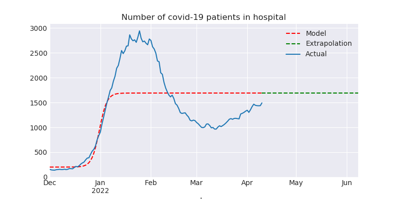
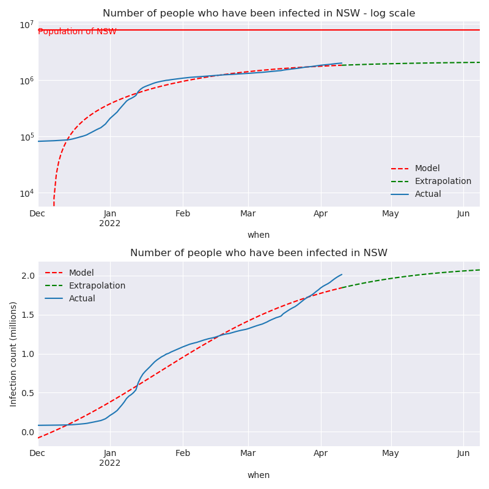

# NSW Covid Update for 2022-04-10

This report is available in several formats:

- [NSW Covid Report 2022-04-10 PDF Format](https://github.com/solresol/yet-another-pandemic-prediction/raw/main/output/2022-04-10/nsw-covid-report-2022-04-10.pdf)

- [NSW Covid Report 2022-04-10 Word Format](https://github.com/solresol/yet-another-pandemic-prediction/raw/main/output/2022-04-10/nsw-covid-report-2022-04-10.docx)

- [Online web page](https://github.com/solresol/yet-another-pandemic-prediction/tree/main/output/README.md) (always up-to-date)

## Deaths

Predictions:

| When | Total Deaths | Deaths that Day |
| ---- | ------------ | --------------- |
| Sunday 6th March 2022 | 1910 | 2 |
| Saturday 12th March 2022 | 1919 | 1 |
| Monday 4th April 2022 | 1928 | 0 |

The death rate peaked on **Friday 28th January 2022**.

The final number of deaths (long-term) will
be close to **1929**.

## Hospitalisation

This model isn't smart enough to realise that people get better and leave the hospital.
So it ends up predicting a flat line instead of dropping back down to zero.

The number of people going into hospital peaked on **Friday 31st December 2021**.

## ICU

This model isn't smart enough to realise that people eventually leave the ICU
(either by dying or recovering).
So it ends up predicting a flat line instead of dropping back down to zero.

The number of people going into ICU peaked on **Monday 21st March 2022**.

## Number of people on ventilators

This model isn't smart enough to realise that people only need ventilators for
a short time (either they recover or they die). So it ends up predicting a flat line.

The number of people needing ventilators peaked on **Monday 3rd January 2022**.

## Number of confirmed infections

Predictions:

| When | Total Infections | Infections that day |
| ---- | ------------ | --------------- |
| Monday 11th April 2022 | 1854219 | 6967 |
| Sunday 17th April 2022 | 1892989 | 6111 |
| Sunday 24th April 2022 | 1932131 | 5217 |
| Tuesday 10th May 2022 | 2000912 | 3570 |

The final number of infections (long-term) will
be close to **2138145**.

According to the model, the number of people getting infected each day peaked on **Friday 21st January 2022**. This is a smoothed-out version of reality.

Note that the first chart (showing the population) is a *log* scale chart. Going up by one line in the chart means 10 times as many people have been infected. 

It is possible that there are vastly more cases than have been
reported (e.g. people who took a RAT test and then stayed home until
they recovered without telling anyone and without taking a PCR test);
it is also possible that people aren't testing (because they can't get
RAT tests and because of the disincentives to testing) and so the
numbers here are lower than reality.

# What could be wrong with this model?

- The hospitalisation, ICU and ventilator models all regress a logistic curve. They
should regress a curve that returns back down to zero.

- I'm calculating everything independently of each other (hospitalisations aren't modelled as having a relationship to the number of cases). The further out you go the less accurate it is. Perhaps my inaccuracies are piling up so that even predicting 7 weeks into the future is wrong.

