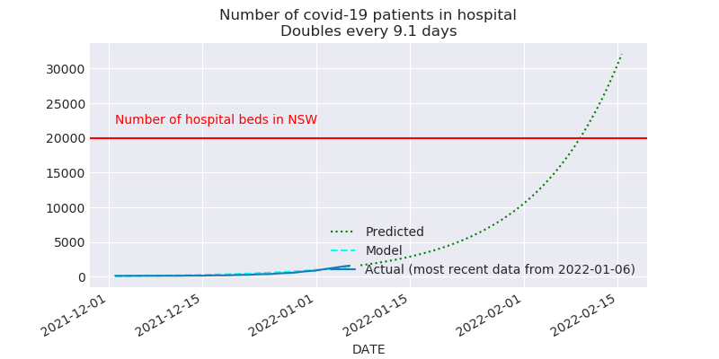
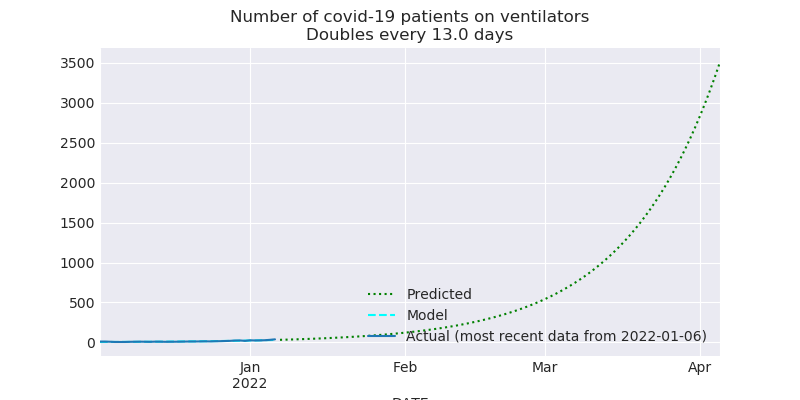
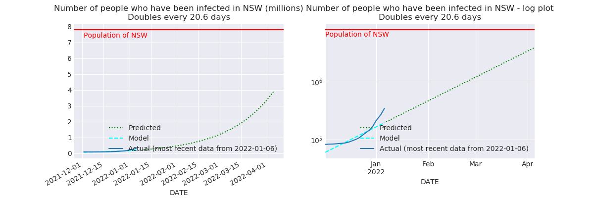
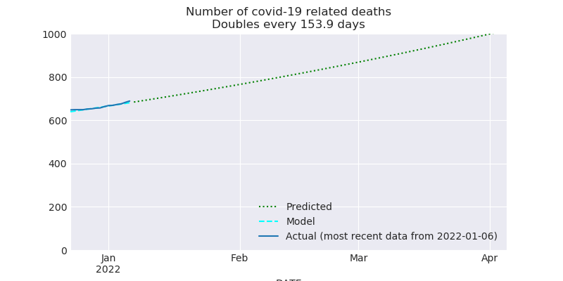
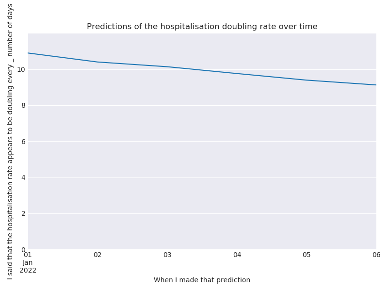
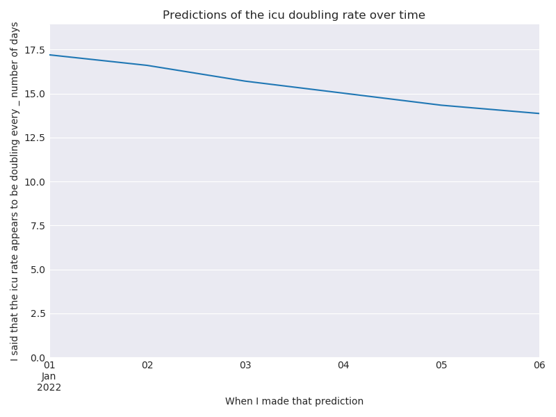
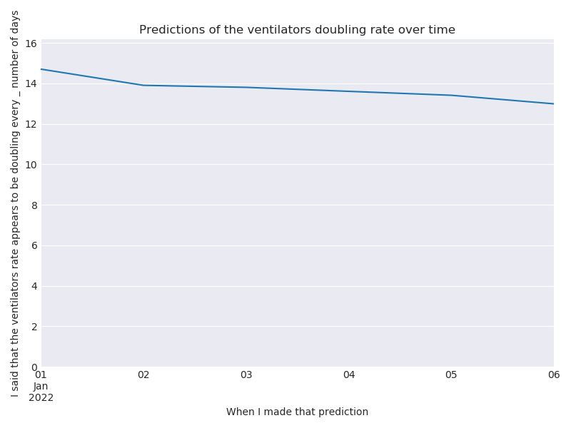
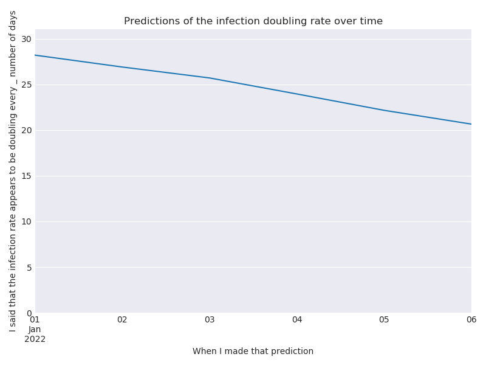
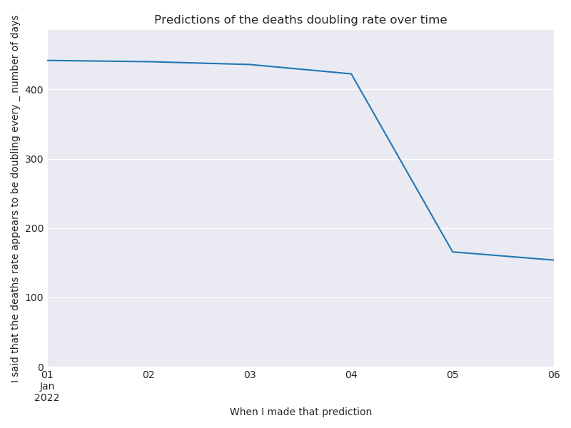

# NSW Covid Update for 2022-01-06

This report is available in several formats:

- [NSW Covid Report 2022-01-06 PDF Format](https://github.com/solresol/yet-another-pandemic-prediction/raw/main/output/2022-01-06/nsw-covid-report-2022-01-06.pdf)

- [NSW Covid Report 2022-01-06 Word Format](https://github.com/solresol/yet-another-pandemic-prediction/raw/main/output/2022-01-06/nsw-covid-report-2022-01-06.docx)

- [Online web page](https://github.com/solresol/yet-another-pandemic-prediction/tree/main/output/README.md) (always up-to-date)

## Hospitalisation

Hospitals will be saturated on **Wednesday 09th February 2022**.

## ICU

Every ICU bed will be occupied on on **Wednesday 09th February 2022**.

## Number of people on ventilators

## Number of confirmed infections

The current outbreak of Covid will peak on **Thursday 24th March 2022**.

## Deaths

# What could be wrong with this model?

- Maybe unvaccinated people are catching Omicron first, and then having the worst outcomes, and going to hospital. So maybe once Omicron has churned through them, the number of hospital places will stop rising.

- Maybe there are vastly more cases than have been reported (e.g. people who took a RAT test and then stayed home until they recovered without telling anyone and without taking a PCR test); so maybe Omicron will saturate the population sooner than my model predicts and so we'll never get to filling the hospitals.

- Maybe the booster doses will have an unexpected effect on the number of people in hospitals, etc. That is, if the booster makes you 8 times less likely to need to go to hospital, then that just delays the date when the hospitals are overloaded by 3 weeks. But if the booster dose has super powers (1000 times less likely to need to go to hospital), then we might never saturate.

- I'm calculating everything independently of each other (hospitalisations aren't modelled as having a relationship to the number of cases). The further out you go the less accurate it is. Perhaps my inaccuracies are piling up so that even predicting 7 weeks into the future is wrong.

# How trustworthy is this?

Here are some charts of how my predictions have changed over time.

A flat line means that I have been quite consistent. A line trending down means that the situation
has been getting worse, and I have been too optimistic.

## Hospitalisation

## ICU

## Number of people on ventilators

## Number of confirmed infections

## Deaths

