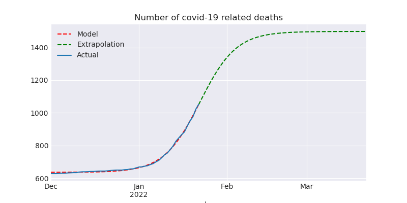
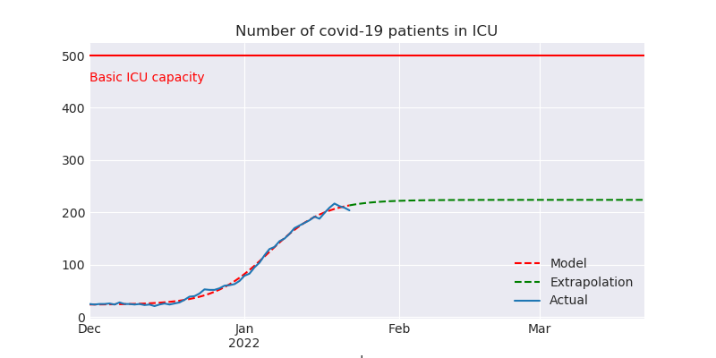

# NSW Covid Update for 2022-01-22

This report is available in several formats:

- [NSW Covid Report 2022-01-22 PDF Format](https://github.com/solresol/yet-another-pandemic-prediction/raw/main/output/2022-01-22/nsw-covid-report-2022-01-22.pdf)

- [NSW Covid Report 2022-01-22 Word Format](https://github.com/solresol/yet-another-pandemic-prediction/raw/main/output/2022-01-22/nsw-covid-report-2022-01-22.docx)

- [Online web page](https://github.com/solresol/yet-another-pandemic-prediction/tree/main/output/README.md) (always up-to-date)

## Deaths

## Hospitalisation

This model isn't smart enough to realise that people get better and leave the hospital.
So it ends up predicting a flat line instead of dropping back down to zero.

## ICU

This model isn't smart enough to realise that people eventually leave the ICU
(either by dying or recovering).
So it ends up predicting a flat line instead of dropping back down to zero.

## Number of people on ventilators

This model isn't smart enough to realise that people only need ventilators for
a short time (either they recover or they die). So it ends up predicting a flat line.

## Number of confirmed infections

Note that this is a *log* scale chart. Going up by one line in the chart means
10 times as many people have been infected. It is possible that 
there are vastly more cases than have been reported (e.g. people who took a RAT test and then stayed home until they recovered without telling anyone and without taking a PCR test); so maybe Omicron will saturate the population sooner than my model predicts and so we'll never get to filling the hospitals.

# What could be wrong with this model?

- The hospitalisation, ICU and ventilator models all regress a logistic curve. They
should regress a curve that returns back down to zero.

- I'm calculating everything independently of each other (hospitalisations aren't modelled as having a relationship to the number of cases). The further out you go the less accurate it is. Perhaps my inaccuracies are piling up so that even predicting 7 weeks into the future is wrong.

